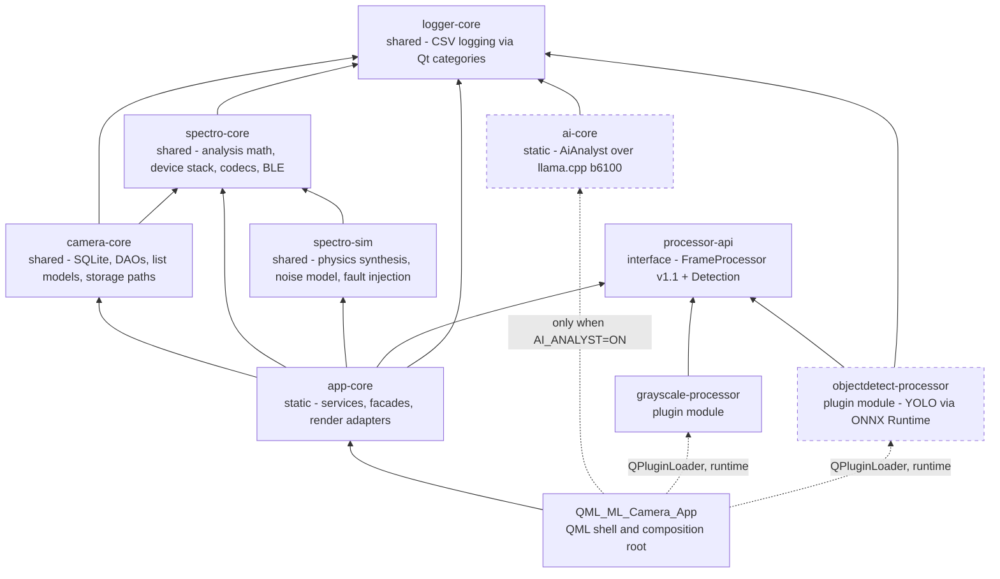
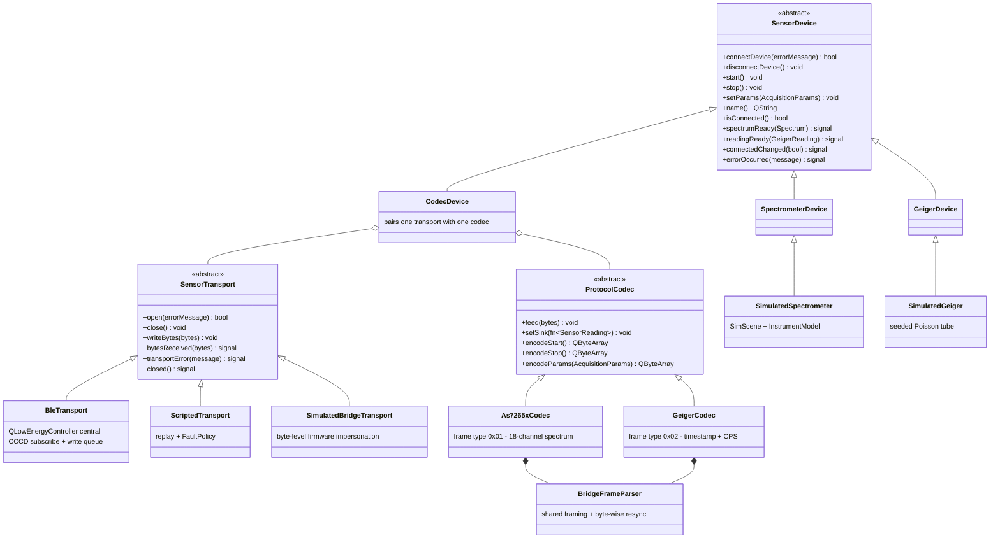
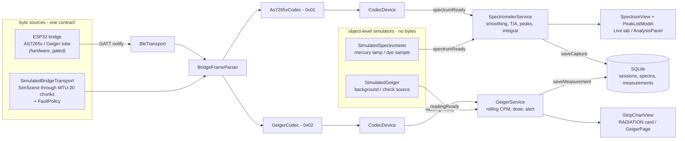
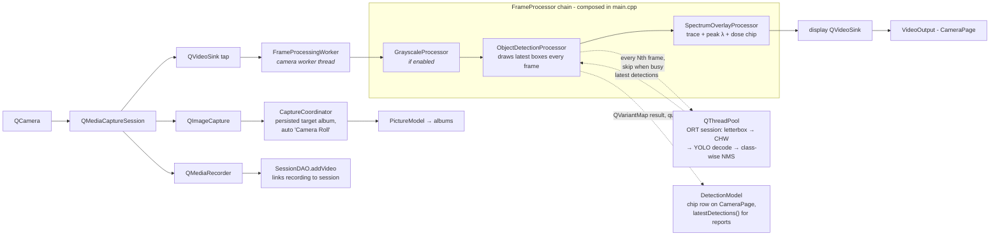
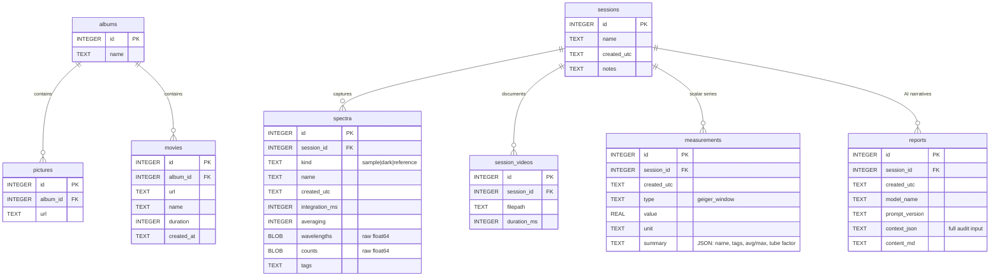
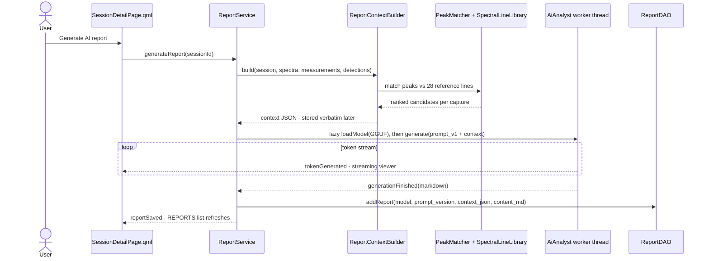
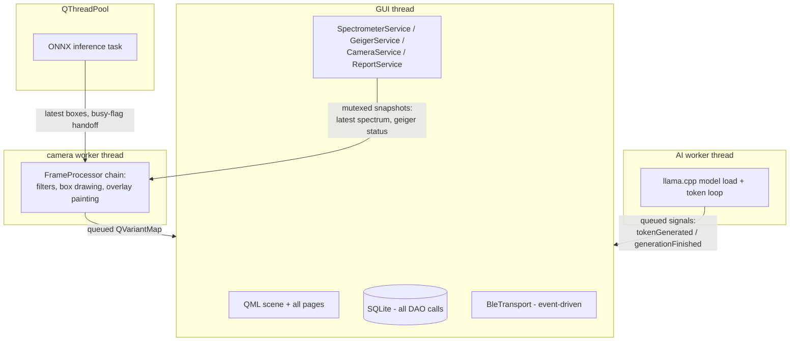

# solid-broccoli — Architecture Atlas

This is the canonical architecture document. Diagrams are [Mermaid](https://mermaid.js.org/)
embedded in fenced code blocks, so GitHub renders them inline and every change
is reviewable in a plain-text diff. A styled standalone mirror of the same
diagrams lives at [architecture.html](architecture.html) (open it in a browser;
it needs internet access once for the Mermaid CDN). **When the two disagree,
this file wins — update it first.**

Companion documents: [USER_MANUAL.md](USER_MANUAL.md) (how to operate the app),
[`SPECTRO_TRICORDER_EXECPLAN.md`](../SPECTRO_TRICORDER_EXECPLAN.md) (the closed
build record — its Decision Log is the extended commentary to this file), and
[`SPECTRO_FIELD_READINESS_EXECPLAN.md`](../SPECTRO_FIELD_READINESS_EXECPLAN.md)
(the active plan: what remains gated on models, hardware, and Android).

---

## 1. The product in one paragraph

A tricorder-style multi-sensor instrument for tablets and desktops, built on
Qt 6/QML. It acquires optical spectra (simulated instruments today, an ESP32 +
AS7265x bridge over Bluetooth Low Energy when hardware is present), computes
transmittance/absorbance/peaks/integrals, records radiation dose from a Geiger
counter as a second modality, keeps a lab notebook of sessions in SQLite,
documents experiments with camera photos and spectrum-overlaid video, runs an
optional ONNX object detector on the live preview, and generates optional
on-device AI session reports whose every factual claim comes from deterministic
code — the language model only narrates.

Three rules shape everything below:

1. **Thin views.** All logic is C++; QML contains layout, styling, bindings,
   and invokable calls only.
2. **Sans-IO codecs.** Protocol parsers never touch a socket or radio; they
   translate bytes to readings. Transports move bytes and know nothing about
   their meaning. Either side is testable alone.
3. **The bare machine builds green.** A fresh clone with no ONNX Runtime, no
   llama.cpp, and no model weights configures, builds, and passes 100% of the
   test suite. Heavy dependencies are strictly additive.

## 2. Build targets and dependencies

Ten CMake targets. Solid arrows are link-time dependencies; dashed arrows are
optional or runtime-only relationships.

Qt modules: Core, Gui, Qml, Quick, QuickControls2, Sql, Svg, Multimedia,
Bluetooth (linked by `spectro-core`), Test (tests only).

**The two optionality axes**, both proven by scratch builds rather than
claimed:

| Axis | Absent behaviour | Guard |
|---|---|---|
| ONNX Runtime | `objectdetect-processor` target is skipped at configure with a status message; app and all tests still build and pass | `find_path`/`find_library` in [plugins/objectdetect/CMakeLists.txt](../QML_ML_Camera/plugins/objectdetect/CMakeLists.txt) |
| llama.cpp | `ai-core` and `ReportService` are not built; stored reports remain viewable/exportable (viewing lives in camera-core) | `-DAI_ANALYST=OFF`, or FetchContent unavailable |

Model weights (ONNX, GGUF) are never committed and never bundled; tests that
need them `QSKIP` when absent.

## 3. The sensor device stack (UML)

The heart of the instrument side. Everything below the service layer is
sensor-neutral: one transport interface, one codec interface, one generic
device that pairs them. A new modality adds a codec and a semantic device
subclass — nothing else changes (Milestone 10 proved it: the Geiger counter
touched zero lines of transport/codec/device plumbing).

Both typed ready-signals live on the `SensorDevice` base (moc cannot template
signals); a device simply never emits the one that does not apply. The
`SensorReading` sink type is `std::variant<Spectrum, GeigerReading>`.

**Wire contract** ([BridgeContract.h](../QML_ML_Camera/spectro-core/BridgeContract.h)):
frames are `u32 LE length` + magic `0x5BEC` + version `0x01` + type byte +
payload, notified in MTU-20 chunks on characteristic `5B0C0002-…`; commands
(`0x01` start, `0x02` stop, `0x03` params) are written to `5B0C0003-…`.
Resynchronization is a byte-wise shift-and-rescan that trusts a frame only
when length, magic, and version agree at the same offset.
`SimulatedBridgeTransport` builds its frame bytes independently of the codecs
*on purpose* — parser and generator arbitrated by hand-built test frames is
what makes the loopback an executable specification of the future firmware.

## 4. Sensor data flow — bytes to pixels

`SpectrometerService` owns the active lab-notebook session
(`ensureActiveSession()`); `GeigerService` receives it as a provider function
from `main.cpp`, so captures and dose measurements land in the same session
without the services knowing each other.

## 5. Camera and vision pipeline

The camera side reuses one plugin interface for three different jobs:
aesthetic filters (grayscale), instrumentation (spectrum overlay), and machine
learning (object detection). Interface v1.1 added a structured result
side-channel so a detector can publish *data*, not just pixels.

Two loading paths, deliberately distinct:

- `app/plugins/` is scanned generically by `PluginManager` — each found plugin
  gets a Settings toggle.
- `app/vision/` is loaded explicitly by `main.cpp` and owned by the Settings
  VISION switch — one toggle, one owner, like the built-in overlay. This keeps
  the detector from acquiring a second competing enable path.

The inference decoupling is the latency contract: preview never blocks on the
model. Inference runs on a pool thread at a configurable stride; the freshest
boxes are drawn on every frame in between.

## 6. Persistence (ER)

One SQLite file, opened by `DatabaseManager` at
`StorageLocations::databasePath()` (platform `AppDataLocation`). Cascades are
explicit in `SessionDAO::removeSession` / `AlbumModel` code — there are no
SQL-level foreign-key constraints (SQLite legacy of the original gallery app;
new tables follow the existing pattern).

(`CSVTable` — the legacy in-DB log mirror shown on the Logger page — stands
alone with `Time`/`Type`/`Message` columns.)

Design notes worth knowing before touching this layer:

- Spectra store wavelengths/counts as raw little-endian float64 blobs — exact
  round-trip, no text parsing, tested to bit equality.
- `measurements` is generic on purpose (type + value + unit + JSON summary):
  the next scalar modality (e.g. A-scan-derived thickness) is a new `type`
  string, not a new table.
- `reports.context_json` stores the complete model input verbatim. Every AI
  report is auditable: you can always see exactly which deterministic facts
  the narrative was grounded on.

## 7. AI report generation (sequence)

Grounding first, language second. Deterministic code produces every factual
claim; the model writes prose around an immutable table.

Determinism levers: greedy sampling, versioned prompt
([prompts/report_v1.md](../QML_ML_Camera/app/prompts/report_v1.md) — a prompt
is an interface), llama.cpp pinned to tag `b6100`, fixed caveat footer forced
by the prompt. The model never sees raw spectral arrays.

## 8. Threading map

Cross-thread rules as implemented: the overlay and detector read service state
through mutex-guarded snapshot getters (never live references); detection
results and AI tokens cross back via queued connections; the detector skips
inference while the previous one runs (`std::atomic` busy flag) instead of
queueing frames; SQLite is only ever touched from the GUI thread.

## 9. QML shell

`main.qml` = `ApplicationWindow` + bottom `TabBar` + `StackLayout` with one
`StackView` per tab: **Live** (spectral viewfinder + RADIATION card +
AnalysisPanel docked ≥900 px, drawer below), **Sessions**, **Camera**,
**Photos**, **Videos**, **Settings**. `NavPage.qml` is the page chrome
(nav bar, back chevron, trailing slot). `Theme.qml` is the single design-token
source (`pragma Singleton`, registered in `qmldir`): near-black surfaces, one
yellow accent `#FFE100`, red strictly for record/radiation-alert/destructive,
Menlo for numeric readouts. `Style.qml` is a legacy shim onto Theme tokens.
Custom scene-graph items: `SpectrumView` (grid, traces, overlays, integration
band, gesture zoom/pan, and nearest-point cursor) and `StripChartView` (scrolling dose chart, threshold
line, compact sparkline mode) — both registered from C++ under
`solid.broccoli 1.0`.

The composition root registers `AppContext` as the typed facade for models and
coordinators, plus service singletons such as `SpectrometerService`,
`GeigerService`, and `CameraService`. `AppNotifier` owns the one global toast
surface, while `HelpContent` exposes the bundled `USER_MANUAL.md`. The
tooling-only module description under `QML_ML_Camera/qmltypes/` mirrors this
runtime surface for `qmllint` and editor completion. `tst_qml_boot` launches
the actual shell offscreen and fails on engine warnings or an empty root.

## 10. How to extend

**A new sensor modality** (the Milestone 10 recipe): add a reading type to
`SensorReading`; add a codec for its frame type over the shared
`BridgeFrameParser`; add a semantic `SensorDevice` subclass; add a scene to
the simulator and a `geigerSource`-style mode to `SimulatedBridgeTransport`;
add a service owning its math (pure functions in spectro-core, ground-truth
tested); persist scalars into `measurements` with a new `type` string. The
transport/framing/session layers need zero changes.

**A new frame plugin**: implement `FrameProcessor` v1.1
([processor-api/FrameProcessor.h](../QML_ML_Camera/processor-api/FrameProcessor.h));
pixels-only plugins ignore `setResultSink`/`configure` (default no-ops). Drop
into `app/plugins/` for a generic Settings toggle, or follow the
`app/vision/` explicit-load pattern when the feature owns dedicated UI.

**A new table**: DAO in camera-core, `CREATE TABLE IF NOT EXISTS` in its
`init()`, wire into `DatabaseManager`, add the explicit cascade to
`SessionDAO::removeSession` (or the owning parent), and a `:memory:`
round-trip + cascade test. Old on-disk databases must upgrade in place.

## 11. Known debts (deliberate, recorded)

- `camera-core` is really *data-core* — it predates the instrument and keeps
  its name to avoid target churn (Decision Log, 2026-07-03).
- The runtime singleton registrations and the tooling-only `plugins.qmltypes`
  manifest describe the same public QML API in two forms. Any new registered
  property or method must update both; the boot smoke test guards runtime
  wiring and `tst_qmllint` guards the tooling copy.
